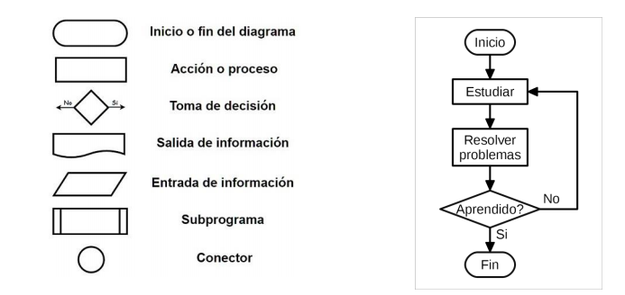
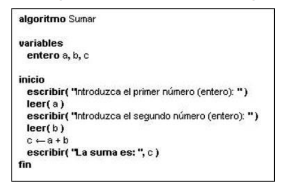
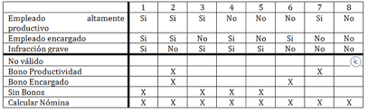

## Introducció

Una de les principals raons que mou una persona a aprendre programació és utilitzar un dispositiu (siga un ordinador o no) com a ferramenta per a resoldre determinats problemes. Com en la vida real, la cerca i l'obtenció d'una solució a un problema determinat, utilitzant mitjans informàtics, es du a terme seguint uns passos fonamentals: observar i comprendre el problema (anàlisi), plantejar possibles solucions (disseny i desenvolupament d'un algoritme) i aplicar la solució adequada (implementació i resolució).

En esta unitat farem un recorregut pels conceptes fonamentals de la programació, partint de la resolució de problemes mitjançant algoritmes i de les diferents formes de representar-los. Estudiarem els elements bàsics que intervenen en un programa, com els tipus de dades, variables, constants, operadors i expressions, i aprendrem a utilitzar les principals estructures de control per a determinar el flux d'execució d'un algoritme.

Amb els continguts d'esta unitat començarem a treballar principalment els resultats d'aprenentatge (RA) següents del mòdul de Programació:

- RA1. «Reconeix l'estructura d'un programa informàtic, identificant i relacionant els elements propis del llenguatge de programació utilitzat».
- RA3. «Escriu i depura codi, analitzant i utilitzant les estructures de control del llenguatge».

Estos resultats d'aprenentatge no finalitzen en esta unitat. Els conceptes que estudiarem ací constituïxen la base sobre la qual anirem construint programes cada vegada més complets al llarg del curs, aprofundint posteriorment en la seua implementació mitjançant un llenguatge de programació i en els principis de la programació orientada a objectes.

## Algoritmes i programes

Quan intentem trobar la solució a un problema, busquem que siga correcta, eficaç i alhora eficient. Per a aconseguir-ho, en programació, haurem de desenvolupar l'algoritme adequat. Però, què és un algoritme?

:::note[Definició]
**Algoritme:** Conjunt ordenat i finit d'operacions que permet trobar la solució d'un problema.
:::

Els algoritmes són independents dels llenguatges de programació i dels ordinadors on s'executen. Un mateix algoritme es pot expressar en diferents llenguatges de programació i es podria executar en diferents dispositius.

La diferència fonamental entre algoritme i programa és que, en el segon, els passos que permeten resoldre el problema s'han d'escriure en un llenguatge de programació determinat perquè es puguen executar en l'ordinador i així obtindre la solució.

Els llenguatges de programació són només un mitjà per a expressar l'algoritme i l'ordinador, un processador per a executar-lo. El disseny dels algoritmes serà una tasca que necessitarà creativitat i coneixements de les tècniques de programació. Estils diferents, de diferents programadors a l'hora d'obtindre la solució del problema, donaran lloc a algoritmes diferents, igualment vàlids.

| Problema                               | Algoritme                                                                   | Programa                                                      | Execució                                                             |
| -------------------------------------- | --------------------------------------------------------------------------- | ------------------------------------------------------------- | -------------------------------------------------------------------- |
| Necessitat o tasca que volem resoldre. | Seqüència finita i no ambigua de passos per a resoldre una classe de casos. | Implementació d'un algoritme en un llenguatge de programació. | Realització efectiva de les instruccions sobre unes dades concretes. |

En essència, tot problema es pot descriure per mitjà d'un algoritme i les característiques fonamentals que estos han de complir són:

- Precís: indica què es fa i en quin ordre.
- Finit: acaba després d'un nombre finit de passos per a les entrades previstes.
- General: resol una classe de casos, no només un exemple aïllat.
- Determinista, quan correspon: amb les mateixes entrades produïx el mateix resultat. No és una propietat obligatòria de tot algoritme: existixen algoritmes aleatoritzats.

Però quan els problemes són complexos, és necessari descompondre'ls en subproblemes més simples i, al seu torn, en altres més menuts. Estes estratègies reben el nom de disseny descendent (metodologia de disseny de programes que consistix en la descomposició del problema en problemes més senzills de resoldre) o disseny modular (metodologia de disseny de programes que consistix a dividir la solució a un problema en mòduls més menuts o subprogrames; les solucions dels mòduls s'uniran per a obtindre la solució general del problema). Este sistema es basa en el lema «dividix i venceràs».

Per a representar gràficament els algoritmes que dissenyarem, tenim a la nostra disposició diferents ferramentes que ajudaran a descriure el seu comportament d'una manera precisa i genèrica per a després poder codificar-los amb el llenguatge que ens interesse. Entre altres tenim:

- Diagrames de flux: esta tècnica utilitza símbols gràfics per a representar l'algoritme. Sol utilitzar-se en les fases d'anàlisi.



- Pseudocodi: esta tècnica es basa en l'ús de paraules clau en llenguatge natural, constants (estructura de dades que s'utilitza en els llenguatges de programació i que no pot canviar el seu contingut durant el programa), variables (estructura de dades que, com el seu nom indica, pot canviar de contingut al llarg de l'execució d'un programa), altres objectes, instruccions i estructures de programació que expressen de forma escrita la solució del problema.



- Taules de decisió: en una taula es representen les possibles condicions del problema amb les seues accions respectives. Sol ser una tècnica de suport al pseudocodi quan existixen situacions condicionals complexes.



### Parts d'un algoritme

Tot algoritme ha de constar de les parts següents:

- Input o entrada. La introducció de les dades que l'algoritme necessita per a operar.
- Procés. Es tracta de l'operació lògica formal que l'algoritme durà a terme amb allò que ha rebut de l'input.
- Output o eixida. Els resultats obtinguts del procés sobre l'input, una vegada acabada l'execució de l'algoritme.

### Elements bàsics d'un algoritme

Atés que un algoritme és un conjunt d'instruccions elaborades amb la finalitat de resoldre un problema, els elements que s'utilitzen en la construcció d'algoritmes són els següents:

#### Dades

Una dada és un camp que pot convertir-se en informació. Una dada pot significar un número, una lletra, un signe ortogràfic o qualsevol símbol que represente una quantitat, una mesura, una paraula o una descripció. La importància de les dades està en la seua capacitat d'associar-se dins d'un context per a convertir-se en informació. És a dir, per si mateixes les dades no tenen capacitat de comunicar un significat i, per tant, no poden afectar el comportament de qui les rep. Per a ser útils, les dades han de convertir-se en informació que oferisca un significat, coneixement, idees o conclusions.

Les dades simples poden ser:

- Numèriques (reals, enteres).
- Lògiques.
- Caràcter (Char, String).
- Variables i constants.
- Operadors.

#### Variables i constants

Són espais de memòria creats per a contindre dades que, d'acord amb la seua naturalesa, es volen mantindre (constants) o que poden variar (variables).

#### Operadors

Són elements que relacionen de manera diferent els valors d'una o més variables i/o constants. És a dir, els operadors ens permeten manipular valors. Poden ser de 3 tipus:

- **Aritmètics** (+ Suma, - Resta, \* Multiplicació, / Divisió, % Mòdul, ++ Increment en 1, -- Decrement en 1).
- **Relacionals** (> Major, < Menor, >= Major o igual, <= Menor o igual, == Igual, != Diferent).
- **Lògics** (&& I lògic (AND), || O lògic (OR), ! Negació (NOT)).
- **Assignació** (+= Suma i assignació, -= Resta i assignació, \*= Multiplicació i assignació, /= Divisió i assignació, %= Mòdul i assignació).

#### Instruccions o paraules reservades

Les ordres no són més que accions que l'algoritme ha d'interpretar i executar en l'ordinador. Cada ordre conserva una sintaxi determinada, és a dir, la forma d'utilitzar-la. Pel que fa a les instruccions, en podem trobar de declaratives, d'assignació, condicionals, de control (bucles), d'entrada o d'eixida.

**Exemple d'algoritme**

Passar una distància en metres a quilòmetres (1 quilòmetre = 1000 metres):

```text
Inici
    1- IMPRIMIR 'Introduïx la distància en metres'
    2- LLEGIR: distancia
    3- CALCULAR quilometresCalculats=distancia/1000
    4- IMPRIMIR 'La distància en quilòmetres és: ', quilometresCalculats
Fi
```

**Representació gràfica**


## Estructures de control: condicionals i bucles

Entre les instruccions que un algoritme pot contindre, unes de les més importants són les estructures de control. Sense elles, les instruccions d'un algoritme només podrien executar-se en l'ordre en què estan escrites (ordre seqüencial). Les estructures de control permeten modificar este ordre. Hi ha dos categories d'estructures de control:

- Condicionals o bifurcacions: permeten que s'executen conjunts diferents d'instruccions, en funció que es verifique o no una condició determinada.
- Bucles o repeticions: permeten que s'execute repetidament un conjunt d'instruccions, bé un nombre predeterminat de vegades, o bé fins que es verifique una condició determinada.

### Estructura condicional simple: IF

Este és el tipus més senzill d'estructura condicional. Servix per a implementar accions condicionals del tipus següent:

- Si es verifica una condició determinada, executar una sèrie d'instruccions i després continuar.
- Si la condició NO es complix, NO s'executen estes instruccions i es continua.


Observeu que, en els dos casos (tant si es verifica la condició com si no), els «camins» bifurcats s'unixen posteriorment en un punt; és a dir, el flux del programa recupera el seu caràcter seqüencial i es continua executant per la instrucció següent a l'estructura IF.

**Exemple d'algoritme**

Determinar si una quantitat donada és major o menor que 0.

```text
Inici
    1- IMPRIMIR 'Introduïx la quantitat'
    2- LLEGIR: quantitat
    3- FER resultat = NO
    4- Si x>0
           FER resultat = SI
       Fi Si
    5- IMPRIMIR 'La quantitat introduïda ', resultat, ' és major que zero'
Fi
```

### Estructura condicional doble: IF-ELSE

Este tipus d'estructura permet implementar condicionals en què hi ha dos accions alternatives:

- Si es verifica una condició determinada, executar una sèrie d'instruccions (bloc 1).
- Si no, és a dir, si la condició NO es verifica, executar una altra sèrie d'instruccions (bloc 2).

En altres paraules, en este tipus d'estructures hi ha una alternativa: es fa una cosa o es fa l'altra. En els dos casos, es continua per la instrucció següent a l'estructura IF - ELSE.

**Exemple d'algoritme**

Llegir 3 números i deduir si s'han introduït en ordre creixent o decreixent.

```text
Inici
    1- IMPRIMIR 'Introduïx 3 números'
    2- LLEGIR: numero1
    3- LLEGIR: numero2
    4- LLEGIR: numero3
    5- SI (numero1 < numero2) AND (numero2 < numero3)
           IMPRIMIR 'Ordre creixent'
       SINÓ
           IMPRIMIR 'Ordre decreixent'
       Fi Si
Fi
```


### Estructura condicional múltiple: IF-ELSE-ELSE

En la seua forma més general, l'estructura IF - ELSEIF - ELSE permet implementar condicionals més complicats, en què s'«encadenen» condicions de la forma següent:

- Si es verifica la condició 1, executar les instruccions del bloc 1.
- Si no es verifica la condició 1, però SÍ que es verifica la condició 2, executar les instruccions del bloc 2.
- Si no, és a dir, si no s'ha verificat cap de les condicions anteriors, executar les instruccions del bloc 3.

En qualsevol dels casos, el flux del programa continua per la instrucció següent a l'estructura.

**Exemple d'algoritme**

Determinar si un número donat és positiu, negatiu o nul.

```text
Inici
    1- IMPRIMIR 'Introduïx un número'
    2- LLEGIR: numero
    5- SI (numero > 0)
           IMPRIMIR 'El número té signe positiu'
       SINÓ, si X<0
           IMPRIMIR 'El número té signe negatiu'
       SINÓ
           IMPRIMIR 'El número és nul'
       Fi Si
Fi
```


En l'estructura IF - ELSEIF - ELSE es pot multiplicar la clàusula ELSE IF i obtindre així una «cascada» de condicions, com es mostra en la imatge següent, el funcionament de la qual és clar. En este tipus d'estructura condicional, la clàusula ELSE juntament amb el seu bloc d'instruccions pot no estar present.


Les diferents estructures condicionals descrites es poden imbricar; és a dir, es pot incloure una estructura IF (de qualsevol tipus) com a part de les instruccions que formen el bloc d'un dels casos d'un altre IF. Com és lògic, no hi pot haver solapament. Cada estructura IF ha de tindre el seu propi final (end).

### Estructura de repetició indexada: FOR

Este tipus d'estructura permet implementar la repetició d'un cert conjunt d'instruccions un nombre predeterminat de vegades. Per a fer-ho, s'utilitza una variable de control del bucle, anomenada també índex, que va recorrent un conjunt prefixat de valors en un ordre determinat. Per a cada valor de l'índex en este conjunt, s'executa una vegada el mateix conjunt d'instruccions.

**Exemple d'algoritme**

Donat un enter, n, calcular la suma dels n primers números senars.

```text
Inici
    1- IMPRIMIR 'Introduïx un número n'
    2- LLEGIR: numero
    3- FER suma=0
    4- Per a i= 1, 3, 5, ..., 2*n-1
           FER suma=suma+i
       Fi Per a
    5- IMPRIMIR 'La suma val: ', suma
Fi
```


### Estructura repetitiva condicional: WHILE

Permet implementar la repetició d'un mateix conjunt d'instruccions mentre es verifique una condició determinada: el nombre de vegades que es repetirà el cicle no està definit a priori.


El seu funcionament és el següent:

- Al començament de cada iteració s'avalua l'expressió lògica.
- Si el resultat és VERDADER, s'executa el conjunt d'instruccions i es torna a iterar; és a dir, es repetix el pas 1.
- Si el resultat és FALS, es deté l'execució del cicle WHILE i el programa continua executant-se per la instrucció següent a l'END.

**Exemple d'algoritme**

Imprimir de forma ascendent els 100 primers números naturals.

```text
Inici
    1- FER final=100
    2- Mentre i<=100
           IMPRIMIR i
           FER i=i+1
       Fi Mentre
Fi
```

Existix una alternativa al WHILE, que és DO-WHILE, en què el bloc d'instruccions s'executa almenys una vegada i la comprovació de la condició és posterior a esta primera execució.


### Estructura d'elecció entre diversos casos: SWITCH

Este tipus d'estructura permet decidir entre diversos camins possibles, en funció del valor que prenga una instrucció determinada.


En cadascun dels casos, el valor corresponent pot ser un sol valor o bé un conjunt de valors, i en este cas s'indiquen entre claus. La clàusula OTHERWISE i el seu conjunt d'instruccions corresponent poden no estar presents.

El funcionament és el següent:

- Al començament s'avalua l'expressió.
- Si l'expressió pren el valor (o valors) especificats al costat de la primera clàusula CASE, s'executa el conjunt d'instruccions d'este cas i després s'abandona l'estructura SWITCH, continuant per la instrucció següent a l'END.
- Es repetix el procediment anterior, de manera ordenada, per a cadascuna de les clàusules CASE que seguixen.
- Si la clàusula OTHERWISE està present i l'expressió no ha pres cap dels valors especificats anteriorment, s'executa el conjunt d'instruccions corresponent.

Observeu que s'executa, com a màxim, el conjunt d'instruccions d'un dels casos; és a dir, una vegada que s'ha verificat un cas i s'ha executat el seu conjunt d'instruccions, no es comprova la resta de casos, ja que s'abandona l'estructura. Òbviament, si la clàusula OTHERWISE no està present, pot passar que no es done cap dels casos.

**Exemple d'algoritme**

Demanar un número a l'usuari i mostrar el nom del dia al qual correspon (1=dilluns).

```text
Inici
    1- IMPRIMIR 'Introduïx un número de l’1 al 7'
    2- LLEGIR: numero
    2- Triar cas numero
           Cas 1
               IMPRIMIR 'Dilluns'
           Cas 2
               IMPRIMIR 'Dimarts'
           Cas 3
               IMPRIMIR 'Dimecres'
           Cas 4
               IMPRIMIR 'Dijous'
           Cas 5
               IMPRIMIR 'Divendres'
           Cas 6
               IMPRIMIR 'Dissabte'
           Cas 7
               IMPRIMIR 'Diumenge'
           En un altre cas
               IMPRIMIR 'El número introduït no està entre 1 i 7'
       Fi Triar cas
Fi
```
