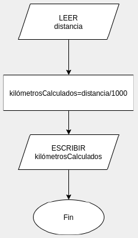
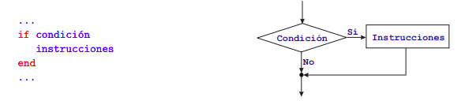
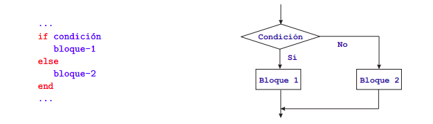
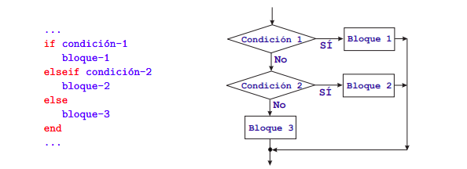
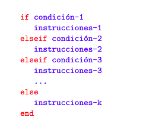
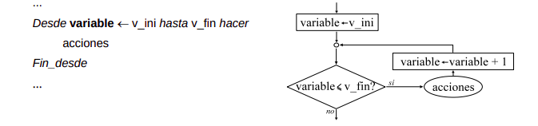
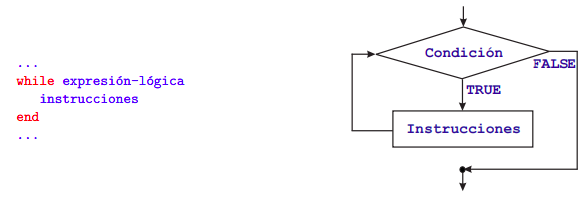
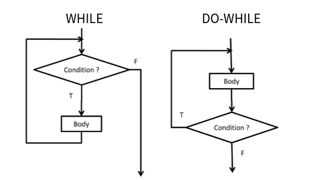
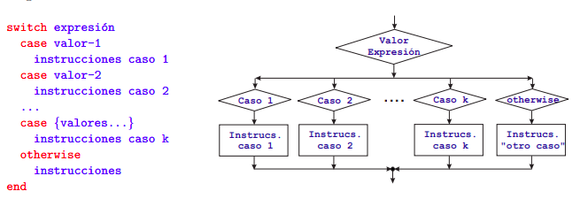

## Introducción

Una de las principales razones que mueve a una persona a aprender programación es utilizar un dispositivo (ya sea un ordenador o no) como herramienta para resolver determinados problemas. Como en la vida real, la búsqueda y obtención de una solución a un problema determinado, utilizando medios informáticos, se lleva a cabo siguiendo unos pasos fundamentales: observar y comprender el problema (análisis), plantear posibles soluciones (diseño y desarrollo de un algoritmo) y aplicar la solución adecuada (implementación y resolución).

En esta unidad realizaremos un recorrido por los conceptos fundamentales de la programación, partiendo de la resolución de problemas mediante algoritmos y de las distintas formas de representarlos. Estudiaremos los elementos básicos que intervienen en un programa, como los tipos de datos, variables, constantes, operadores y expresiones, y aprenderemos a utilizar las principales estructuras de control para determinar el flujo de ejecución de un algoritmo.

Con los contenidos de esta unidad comenzaremos a trabajar principalmente los siguientes Resultados de Aprendizaje (RA) del módulo de Programación:

- RA1. «Reconoce la estructura de un programa informático, identificando y relacionando los elementos propios del lenguaje de programación utilizado».

- RA3. «Escribe y depura código, analizando y utilizando las estructuras de control del lenguaje».

Estos resultados de aprendizaje no finalizan en esta unidad. Los conceptos que estudiaremos aquí constituyen la base sobre la que iremos construyendo programas cada vez más completos a lo largo del curso, profundizando posteriormente en su implementación mediante un lenguaje de programación y en los principios de la programación orientada a objetos.

## Algoritmos y programas

Cuando intentamos encontrar la solución a un problema, buscamos que esta sea correcta, eficaz y a la vez eficiente. Para conseguirlo, en programación, tendremos que desarrollar el algoritmo adecuado. Pero, ¿Qué es un algoritmo?

:::note[Definición]
**Algoritmo:** Conjunto ordenado y finito de operaciones que permite hallar la solución de un problema.
:::

Los algoritmos son independientes de los lenguajes de programación y de las computadoras donde se ejecutan. Un mismo algoritmo puede ser expresado en diferentes lenguajes de programación y podría ser ejecutado en diferentes dispositivos.

La diferencia fundamental entre algoritmo y programa es que, en el segundo, los pasos que permiten resolver el problema, deben escribirse en un determinado lenguaje de programación para que puedan ser ejecutados en el ordenador y así obtener la solución.

Los lenguajes de programación son sólo un medio para expresar el algoritmo y el ordenador un procesador para ejecutarlo. El diseño de los algoritmos será una tarea que necesitará de la creatividad y conocimientos de las técnicas de programación. Estilos distintos, de distintos programadores a la hora de obtener la solución del problema, darán lugar a algoritmos diferentes, igualmente válidos.

| Problema                                 | Algoritmo                                                                | Programa                                                       | Ejecución                                                             |
| ---------------------------------------- | ------------------------------------------------------------------------ | -------------------------------------------------------------- | --------------------------------------------------------------------- |
| Necesidad o tarea que queremos resolver. | Secuencia finita y no ambigua de pasos para resolver una clase de casos. | Implementación de un algoritmo en un lenguaje de programación. | Realización efectiva de las instrucciones sobre unos datos concretos. |

En esencia, todo problema se puede describir por medio de un algoritmo y las características fundamentales que éstos deben cumplir son:

- **Preciso**: indica qué se hace y en qué orden.
- **Finito**: termina tras un número finito de pasos para las entradas previstas.
- **General**: resuelve una clase de casos, no solo un ejemplo aislado.
- **Determinista**, cuando procede: con las mismas entradas produce el mismo resultado. No es una propiedad obligatoria de todo algoritmo: existen algoritmos aleatorizados.

Pero cuando los problemas son complejos, es necesario descomponer éstos en subproblemas más simples y, a su vez, en otros más pequeños. Estas estrategias reciben el nombre de diseño descendente (metodología de diseño de programas, consistente en la descomposición del problema en problemas más sencillos de resolver.) o diseño modular (metodología de diseño de programas, que consiste en dividir la solución a un problema en módulos más pequeños o subprogramas. Las soluciones de los módulos se unirán para obtener la solución general del problema). Este sistema se basa en el lema divide y vencerás.

Para representar gráficamente los algoritmos que vamos a diseñar, tenemos a nuestra disposición diferentes herramientas que ayudarán a describir su comportamiento de una forma precisa y genérica para luego poder codificarlos con el lenguaje que nos interese. Entre otras tenemos:

- Diagramas de flujo: Esta técnica utiliza símbolos gráficos para la representación del algoritmo. Suele utilizarse en las fases de análisis.

<p align="center">
 
</p>

- Pseudocódigo: Esta técnica se basa en el uso de palabras clave en lenguaje natural, constantes (Estructura de datos que se utiliza en los lenguajes de programación que no puede cambiar su contenido en el transcurso del programa.), variables (Estructura de datos que, como su nombre indica, puede cambiar de contenido a lo largo de la ejecución de un programa.), otros objetos, instrucciones y estructuras de programación que expresan de forma escrita la solución del problema.

<p align="center">
 
</p>

- Tablas de decisión: En una tabla son representadas las posibles condiciones del problema con sus respectivas acciones. Suele ser una técnica de apoyo al pseudocódigo cuando existen situaciones condicionales complejas.

<p align="center">
 
</p>

### Partes de un algoritmo

Todo algoritmo debe constar de las siguientes partes:

- **Input o entrada**. El ingreso de los datos que el algoritmo necesita para operar.
- **Proceso**. Se trata de la operación lógica formal que el algoritmo emprenderá con lo recibido del input.
- **Output o salida**. Los resultados obtenidos del proceso sobre el input, una vez terminada la ejecución del algoritmo.

### Elementos básicos de un algoritmo

Dado que un algoritmo es un conjunto de instrucciones elaboradas con la finalidad de resolver un problema, los elementos que se utilizan en la construcción de algoritmos son los siguientes:

#### Datos

Un dato es un campo que puede convertirse en información. Un dato puede significar un número, una letra, un signo ortográfico o cualquier símbolo que represente una cantidad, una medida, una palabra o una descripción. La importancia de los datos está en su capacidad de asociarse dentro de un contexto para convertirse en información. Es decir, por sí mismos los datos no tienen capacidad de comunicar un significado y por tanto no pueden afectar el comportamiento de quien los recibe. Para ser útiles, los datos deben convertirse en información que ofrezca un significado, conocimiento, ideas o conclusiones.

Los datos simples pueden ser:

- Numéricos (Reales, Enteros)
- Lógicos
- Carácter (Char, String)
- Variables y constantes
- Operadores

#### Variables y constantes

Son espacios de memoria creados para contener datos que de acuerdo a su naturaleza, deseen mantenerse (Constantes) o que puedan variar (Variables).

#### Operadores

Son elementos que relacionan de forma diferente, los valores de una o más variables y/o constantes. Es decir, los operadores nos permiten manipular valores. Pueden ser de 3 tipos:

- **Aritméticos** (+ Suma, - Resta, \* Multiplicación, / División, % Módulo, ++ Incremento en 1, -- Decremento en 1)
- **Relacionales** (> Mayor, < Menor, >= Mayor o igual, <= Menor o igual, == Igual, != Distinto)
- **Lógicos** (&& Y lógico (AND), || O lógico (OR),! Negación (NOT))
- **Asignación** (+= Suma y asignación, -= Resta y asignación, \*= Multiplicación y asignación, /= División y asignación, %= Módulo y asignación)

#### Instrucciones o palabras reservadas

Los comandos no son más que acciones que el algoritmo debe interpretar y ejecutar en el computador. Cada comando conserva una sintaxis determinada, es decir la forma de utilizarlo. En lo que respecta a las instrucciones, podemos encontrar declarativas, de asignación, condicionales, de control (bucles), de entrada o de salida.

**Ejemplo de algoritmo**

Pasar una distancia en metros a kilómetros (1 kilómetro = 1000 metros):

```text
Inicio
            1- IMPRIMIR ’Introduce la distancia en metros’
            2- LEER: distancia
            3- CALCULAR kilómetrosCalculados=distancia/1000
            4- IMPRIMIR ’La distancia en kilómetros es: ’, kilómetrosCalculados
Fin
```

**Representación gráfica**



## Estructuras de control: condicionales y bucles

Entre las instrucciones que un algoritmo puede contener, unas de las más importantes son las estructuras de control. Sin ellas, las instrucciones de un algoritmo sólo podrían ejecutarse en el orden en que están escritas (orden secuencial). Las estructuras de control permiten modificar este orden. Hay dos categorías de estructuras de control:

- Condicionales o bifurcaciones: permiten que se ejecuten conjuntos distintos de instrucciones, en función de que se verifique o no determinada condición.

- Bucles o repeticiones: permiten que se ejecute repetidamente un conjunto de instrucciones, bien un número pre-determinado de veces, o bien hasta que se verifique una determinada condición.

### Estructura condicional simple: IF

Este es el tipo más sencillo de estructura condicional. Sirve para implementar acciones condicionales del tipo siguiente:

- Si se verifica una determinada condición, ejecutar una serie de instrucciones y luego seguir adelante.

- Si la condición NO se cumple, NO se ejecutan dichas instrucciones y se sigue adelante.



Obsérvese que, en ambos casos (que se verifique o no la condición), los “caminos” bifurcados se unen posteriormente en un punto, es decir, el flujo del programa recupera su carácter secuencial, y se continúa ejecutando por la instrucción siguiente a la estructura IF.

**Ejemplo de algoritmo**

Determinar si una cantidad dada es mayor o menor que 0

```text
Inicio
         1- IMPRIMIR ’Introduce la cantidad’
         2- LEER: cantidad
         3- HACER resultado = NO
         4- Si cantidad>0
                   HACER resultado = SI
            Fin Si
         5- IMPRIMIR ’La cantidad introducida ’, resultado, ‘ es mayor que cero’
Fin
```

### Estructura condicional doble: IF-ELSE

Este tipo de estructura permite implementar condicionales en los que hay dos acciones alternativas:

- Si se verifica una determinada condición, ejecutar una serie de instrucciones (bloque 1).

- Si no, esto es, si la condición NO se verifica, ejecutar otra serie de instrucciones (bloque 2).

En otras palabras, en este tipo de estructuras hay una alternativa: se hace una cosa o se hace la otra. En ambos casos, se sigue por la instrucción siguiente a la estructura IF - ELSE.

**Ejemplo de algoritmo**

Leer 3 números y deducir si se han introducido en orden creciente o decreciente

```text
Inicio
         1- IMPRIMIR ’Introduce 3 números’
         2- LEER: numero1
         3- LEER: numero2
         4- LEER: numero3
         5- SI (numero1 < numero2) AND (numero2 < numero3)
                  IMPRIMIR ’Orden creciente’
            SINO
                  IMPRIMIR ’Orden decreciente
            Fin Si
Fin
```



### Estructura condicional múltiple: IF-ELSE-ELSE

En su forma más general, la estructura IF - ELSEIF - ELSE permite implementar condicionales más complicados, en los que se “encadenan” condiciones en la forma siguiente:

- Si se verifica la condición 1, ejecutar las instrucciones del bloque 1.

- Si no se verifica la condición 1, pero SI se verifica la condición 2 , ejecutar las instrucciones del bloque 2.

- Si no, esto es, si no se ha verificado ninguna de las condiciones anteriores, ejecutar las instrucciones del bloque 3.

En cualquiera de los casos, el flujo del programa continúa por la instrucción siguiente a la estructura.

**Ejemplo de algoritmo**

Determinar si un número dado es positivo, negativo o nulo

```text
Inicio
         1- IMPRIMIR ’Introduce un número’
         2- LEER: numero
         5- SI (numero > 0)
                  IMPRIMIR ’El número tiene signo positivo’
           SINO, si numero<0
                   IMPRIMIR ’El número tiene signo negativo’
           SINO
                   IMPRIMIR ’El número es nulo’
           Fin Si
Fin
```



En la estructura IF - ELSEIF - ELSE se puede multiplicar la cláusula ELSE IF, obteniéndose así una “cascada” de condiciones, como se muestra en la siguiente imagen, cuyo funcionamiento es claro. En este tipo de estructura condicional, la cláusula ELSE junto con su bloque de instrucciones puede no estar presente.



Las distintas estructuras condicionales descritas pueden ser anidadas, es decir, puede incluirse una estructura IF (de cualquier tipo), como parte de las instrucciones que forman el bloque de uno de los casos de otro IF. Como es lógico, no puede haber solapamiento. Cada estructura IF debe tener su propio fin (end).

### Estructura de repetición indexada: FOR

Este tipo de estructura permite implementar la repetición de un cierto conjunto de instrucciones un número pre-determinado de veces. Para ello se utiliza una variable de control del bucle, llamada también índice, que va recorriendo un conjunto pre-fijado de valores en un orden determinado. Para cada valor del índice en dicho conjunto, se ejecuta una vez el mismo conjunto de instrucciones.

**Ejemplo de algoritmo**

Dado un entero, n, calcular la suma de los n primeros números impares

```text
 Inicio
          1- IMPRIMIR ’Introduce un número n’
          2- LEER: numero
          3- HACER suma=0
          4- Para i= 1, 3, 5, ..., 2*numero-1
                   HACER suma=suma+i
          Fin Para
          5- IMPRIMIR ’La suma vale : ’, suma
Fin
```



### Estructura repetitiva condicional: WHILE

Permite implementar la repetición de un mismo conjunto de instrucciones mientras que se verifique una determinada condición: el número de veces que se repetirá el ciclo no está definido a priori.



Su funcionamiento es el siguiente:

- Al comienzo de cada iteración se evalúa la expresión-lógica.

- Si el resultado es VERDADERO, se ejecuta el conjunto de instrucciones y se vuelve a iterar, es decir, se repite el paso 1.

- Si el resultado es FALSO, se detiene la ejecución del ciclo WHILE y el programa se sigue ejecutando por la instrucción siguiente al END.

**Ejemplo de algoritmo**

Imprimir de forma ascendente los 100 primeros números naturales

```text
 Inicio
    1- HACER i=1
    2- HACER final=100
    3- Mientras que i<=final
         IMPRIMIR i
         HACER i=i+1
    Fin Mientras
  Fin
```

Existe una alternativa al WHILE que es DO-WHILE en la que el bloque de instrucciones se ejecuta al menos una vez y la comprobación de la condición es posterior a esta primera ejecución



### Estructura de elección entre varios casos: SWITCH

Este tipo de estructura permite decidir entre varios caminos posibles, en función del valor que tome una determinada instrucción.



En cada uno de los casos, el valor correspondiente puede ser o bien un solo valor, o bien un conjunto de valores, en cuyo caso se indican entre llaves. La cláusula OTHERWISE y su correspondiente conjunto de instrucciones puede no estar presente.

El funcionamiento es el siguiente:

- Al comienzo se evalúa la expresión.

- Si la expresión toma el valor (o valores) especificados junto a la primera cláusula CASE, se ejecuta el conjunto de instrucciones de este caso y después se abandona la estructura SWITCH, continuando por la instrucción siguiente al END.

- Se repite el procedimiento anterior, de forma ordenada, para cada una de las cláusulas CASE que siguen.

- Si la cláusula OTHERWISE está presente y la expresión no ha tomado ninguno de los valores anteriormente especificados, se ejecuta el conjunto de instrucciones correspondiente.

Observad que se ejecuta, como máximo el conjunto de instrucciones de uno de los casos, es decir, una vez que se ha verificado un caso y se ha ejecutado su conjunto de instrucciones, no se testea el resto de casos, ya que se abandona la estructura. Obviamente, si la cláusula OTHERWISE no está presente, puede ocurrir que no se dé ninguno de los casos.

**Ejemplo de algoritmo**

Pedir un número al usuario y mostrar el nombre del día al corresponde (1=lunes)

```text
Inicio
         1- IMPRIMIR ’Introduce un número del 1 al 7’
         2- LEER: numero
         2- Elegir caso numero
             Caso 1
              IMPRIMIR ’Lunes’,
             Caso 2
              IMPRIMIR ’Martes’,
             Caso 3
              IMPRIMIR ’Miércoles’,
             Caso 4
              IMPRIMIR ’Jueves’,
             Caso 5
              IMPRIMIR ’Viernes’,
             Caso 6
              IMPRIMIR ’Sábado’,
             Caso 7
              IMPRIMIR ’Domingo’
            En otro caso
               IMPRIMIR ’El número introducido no está entre 1 y 7’
         Fin Elegir caso
Fin
```
