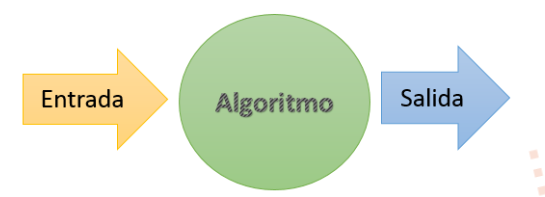
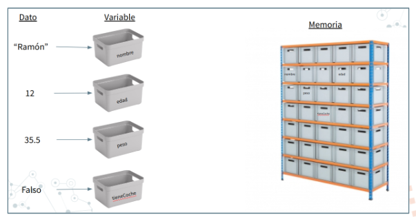

import { Badge } from '@astrojs/starlight/components';

## Algoritmos y programas

Cuando intentamos encontrar la solución a un problema, buscamos que esta sea correcta, eficaz y a la vez eficiente. Para conseguirlo, en programación, tendremos que desarrollar el algoritmo adecuado. Pero, ¿Qué es un algoritmo?

:::note[Definición]
**Algoritmo:** Conjunto ordenado y finito de operaciones que permite hallar la solución de un problema.
:::

Un **algoritmo** describe los pasos necesarios para resolver un problema, sin depender de un lenguaje de programación ni de un dispositivo concreto. Por ejemplo, para calcular la media de dos números, sumamos ambos valores y dividimos el resultado entre dos. Estos pasos son los mismos tanto si los realizamos a mano como si los ejecuta un ordenador.

Un **programa** expresa uno o varios algoritmos mediante las instrucciones de un lenguaje de programación. Así, podemos implementar el algoritmo anterior en Java, Python o cualquier otro lenguaje adecuado. La solución que hemos diseñado es la misma; cambia la forma de escribirla.

La **ejecución** ocurre cuando el dispositivo lleva a cabo las instrucciones del programa con unos datos concretos. Si introducimos los números 6 y 8, el programa calcula su media y obtiene 7.

Un mismo problema puede resolverse mediante algoritmos diferentes. Diseñar una solución requiere comprender el problema, descomponerlo en pasos y comprobar que produce los resultados esperados. Dos soluciones pueden ser correctas y, aun así, diferenciarse en su claridad, en el tiempo que necesitan o en la memoria que utilizan.

| Concepto | Qué significa | Ejemplo |
| --- | --- | --- |
| **Problema** | La tarea que queremos resolver. | Calcular la media de dos números. |
| **Algoritmo** | Una secuencia finita y precisa de pasos para resolverla. | Sumar los dos números y dividir el resultado entre dos. |
| **Programa** | La implementación de la solución en un lenguaje de programación. | Un programa que lee dos números, calcula su media y la muestra. |
| **Ejecución** | La realización de las instrucciones con unos datos concretos. | Al introducir 6 y 8, el programa muestra 7. |

En esencia, todo problema se puede describir por medio de un algoritmo y las características fundamentales que éstos deben cumplir son:

- **Preciso**: indica qué se hace y en qué orden.
- **Finito**: termina tras un número finito de pasos para las entradas previstas.
- **General**: resuelve una clase de casos, no solo un ejemplo aislado.
- **Determinista**, cuando procede: con las mismas entradas produce el mismo resultado. No es una propiedad obligatoria de todo algoritmo: existen algoritmos aleatorizados.

Pero cuando los problemas son complejos, es necesario descomponer éstos en subproblemas más simples y, a su vez, en otros más pequeños. Estas estrategias reciben el nombre de diseño descendente (metodología de diseño de programas, consistente en la descomposición del problema en problemas más sencillos de resolver.) o diseño modular (metodología de diseño de programas, que consiste en dividir la solución a un problema en módulos más pequeños o subprogramas. Las soluciones de los módulos se unirán para obtener la solución general del problema). Este sistema se basa en el lema <Badge text="divide y vencerás." variant="note"/>

## Partes de un algoritmo

En un algoritmo distinguimos tres partes: los datos de partida (**entrada**), las operaciones que realizamos con ellos (**proceso**) y el resultado que obtenemos (**salida**).



**Ejemplo: ¿cuánta pizza nos toca?**

Un grupo de cuatro amigos pide tres pizzas. Cada pizza tiene ocho porciones y quieren repartirlas a partes iguales.

| Parte | Qué representa | En nuestro ejemplo |
| --- | --- | --- |
| **Entrada** | Los datos necesarios para resolver el problema. | 3 pizzas, 8 porciones por pizza y 4 personas. |
| **Proceso** | Las operaciones que realizamos con los datos. | Multiplicar `3 × 8 = 24` y dividir `24 / 4 = 6`. |
| **Salida** | El resultado que obtenemos. | A cada persona le corresponden 6 porciones. |

```text
Inicio
    pizzas ← 3
    porcionesPorPizza ← 8
    personas ← 4
    totalPorciones ← pizzas * porcionesPorPizza
    porcionesPorPersona ← totalPorciones / personas
    IMPRIMIR "Porciones por persona: ", porcionesPorPersona
Fin
```

En estos ejemplos usaremos `←` para indicar **asignación**: calcular lo que hay a la derecha y guardar el resultado en la variable de la izquierda.

:::tip[Tu turno]
Si se apunta una quinta persona, ¿qué parte cambia? ¿Cuántas porciones enteras recibe cada persona y cuántas sobran?
:::

<details>
<summary>Ver solución</summary>

Cambia la entrada `personas`, que pasa a valer 5. Hay que volver a realizar el proceso. Si permitimos cortar las porciones, corresponden 4,8 por persona. Si las queremos enteras, cada persona recibe 4 y sobran 4: en ese caso necesitamos calcular el cociente entero y el resto.

</details>

## Elementos básicos de un algoritmo

Vamos a construir ejemplos de un videojuego en el que un personaje recoge monedas y abre puertas. Nos servirán para conocer los cinco elementos con los que describimos un algoritmo: datos, variables y constantes, operadores y expresiones, instrucciones y estructuras de control. Las palabras reservadas dependen del lenguaje elegido y las veremos al escribir algoritmos en PSeInt.

### Datos

Los **datos** son los valores con los que trabaja un algoritmo. Su tipo indica qué clase de valores representan y qué operaciones tienen sentido con ellos.

| Tipo | Ejemplo en el videojuego | Para qué sirve |
| --- | --- | --- |
| **Entero** | `12` | Contar cantidades sin decimales. |
| **Real** | `8.5` | Representar una medida con decimales, como los segundos de una carrera. |
| **Lógico o booleano** | `VERDADERO` | Representar dos posibilidades: verdadero o falso. |
| **Carácter** | `'W'` | Guardar un único carácter. |
| **Cadena de texto** | `"PixelNinja"` | Guardar una secuencia de caracteres. |

En el pseudocódigo escribimos los decimales con punto. Usamos comillas simples para los caracteres y dobles para las cadenas.

Estos ejemplos son valores. Al escribir `monedas ← 12`, guardamos el dato `12` en una variable.

:::note[Un número también puede ser texto]
`12` es un valor numérico con el que podemos calcular. `"12"` es una cadena de texto: para tratarla como un número, normalmente tendremos que convertirla. Un código de jugador como `"007"` se guarda como texto si queremos conservar los ceros iniciales.
:::

Las variables y las constantes permiten dar nombre a valores; los operadores permiten trabajar con ellos. **No son tipos de datos.**

### Variables y constantes

Una **variable** permite guardar un valor asociado a un nombre y actualizarlo durante la ejecución. Una **constante** tiene un valor que se mantiene fijo una vez definido.

:::tip[Una caja en una estantería]
Imagina que la **memoria** del ordenador es una estantería y cada **variable** es una caja que guarda información. El nombre de la variable es la etiqueta de la caja y su valor es lo que contiene. Al asignarle un nuevo valor, sustituimos el contenido de la caja, pero conservamos su etiqueta.

:::

**Ejemplo: recoger un cofre de monedas**

```text
CONSTANTE PREMIO_COFRE ← 5
monedas ← 10
monedas ← monedas + PREMIO_COFRE
IMPRIMIR monedas
```

| Paso | Qué ocurre | Valor de `monedas` después |
| --- | --- | --- |
| `monedas ← 10` | Inicializamos la variable. | 10 |
| `monedas ← monedas + PREMIO_COFRE` | Leemos el valor actual, sumamos 5 y guardamos el resultado. | 15 |
| `IMPRIMIR monedas` | Mostramos el valor guardado. | 15 |

La instrucción `monedas ← monedas + PREMIO_COFRE` **no es una igualdad matemática**. Primero calcula `10 + 5` y después sustituye el valor anterior por `15`. La constante `PREMIO_COFRE` sigue valiendo `5`.

Usaremos nombres descriptivos como `monedas` o `tieneLlave`. Escribiremos las constantes en mayúsculas como convención para reconocerlas fácilmente.

:::tip[Tu turno]
Si abrimos otro cofre y ejecutamos de nuevo `monedas ← monedas + PREMIO_COFRE`, ¿cuánto valen ahora `monedas` y `PREMIO_COFRE`?
:::

<details>
<summary>Ver solución</summary>

`monedas` pasa a valer `20`. `PREMIO_COFRE` sigue valiendo `5`: se actualiza la variable, no la constante.

</details>

### Operadores y expresiones

Los **operadores** permiten calcular nuevos valores, compararlos o combinar condiciones. Una **expresión** combina valores, variables y operadores para obtener un resultado; por ejemplo, `monedas + 5`.

También es una expresión `edad >= 18 Y tieneEntrada`: su resultado es verdadero solo cuando se cumplen las dos condiciones.

| Tipo | Operadores | Ejemplo | Resultado o efecto |
| --- | --- | --- | --- |
| **Aritméticos** | `+`, `-`, `*`, `/`, `%` | `17 % 5` | Obtiene `2`, el resto de dividir 17 entre 5. |
| **Relacionales** | `>`, `<`, `>=`, `<=`, `==`, `!=` | `12 >= 10` | Obtiene `VERDADERO`. |
| **Lógicos** | `Y`, `O`, `NO` | `VERDADERO Y FALSO` | Obtiene `FALSO`. |
| **Asignación** | `←` en nuestro pseudocódigo | `monedas ← 12` | Guarda `12` en `monedas`. |

En muchos lenguajes, la asignación se escribe `=` y los operadores lógicos se escriben `&&`, `||` y `!`. También existen formas abreviadas como `+=` o `++`; su disponibilidad y comportamiento dependen del lenguaje.

**Ejemplo: abrir la puerta del castillo**

Para abrir una puerta necesitamos **tener la llave y al menos diez monedas**.

```text
monedas ← 12
tieneLlave ← VERDADERO
puedeAbrir ← tieneLlave Y (monedas >= 10)
IMPRIMIR puedeAbrir
```

Primero, `monedas >= 10` produce `VERDADERO`. Después, `VERDADERO Y VERDADERO` produce `VERDADERO`, que se guarda en `puedeAbrir`. Esta expresión comprueba el requisito; no descuenta monedas ni abre la puerta por sí sola.

- **Y** exige que ambas condiciones sean verdaderas: tener llave **y** monedas suficientes.
- **O** exige que al menos una sea verdadera: tener llave **o** tener un pase mágico.
- **NO** invierte el valor lógico: si `tieneLlave` es verdadero, `NO tieneLlave` es falso.

**Ejemplo: preparar paquetes de premios**

Tenemos 17 monedas y cada paquete contiene 5. Podemos preparar 3 paquetes completos y sobran `17 % 5`, es decir, 2 monedas. El operador `%` calcula el **resto**, no un porcentaje.

:::tip[El orden importa]
`2 + 3 * 4` da `14`, porque la multiplicación se realiza antes que la suma. `(2 + 3) * 4` da `20`. Usa paréntesis para dejar claro qué quieres calcular primero.
:::

### Instrucciones

Una **instrucción** indica una acción que ejecuta el algoritmo: asignar un valor, leer un dato, escribir un resultado, seleccionar una opción o repetir unos pasos.

En nuestro pseudocódigo utilizaremos palabras como `LEER` e `IMPRIMIR` para expresar estas acciones.

**Ejemplo: el marcador de una partida**

Cada moneda recogida vale 10 puntos. El algoritmo pide el nombre del jugador y cuántas monedas ha recogido, calcula la puntuación y la muestra. Suponemos que se introduce un número entero de monedas mayor o igual que cero.

```text
Inicio
    CONSTANTE PUNTOS_POR_MONEDA ← 10
    IMPRIMIR "¿Cómo se llama tu personaje?"
    LEER nombre
    IMPRIMIR "¿Cuántas monedas has recogido?"
    LEER monedas
    puntos ← monedas * PUNTOS_POR_MONEDA
    IMPRIMIR "Jugador: ", nombre
    IMPRIMIR "Puntuación: ", puntos
Fin
```

Si introducimos `PixelNinja` y `7`, la salida será:

```text
Jugador: PixelNinja
Puntuación: 70
```

Aquí aparecen todos los elementos que hemos visto: **datos** de texto y numéricos, **variables** (`nombre`, `monedas`, `puntos`), una **constante** (`PUNTOS_POR_MONEDA`), un **operador** de multiplicación e **instrucciones** de entrada, asignación y salida.

:::tip[Prueba una modificación]
Añade una bonificación fija de 50 puntos por terminar la partida. ¿Qué constante añadirías y cómo cambiarías el cálculo? ¿Qué puntuación obtendría PixelNinja con sus 7 monedas?
:::

<details>
<summary>Ver solución</summary>

```text
CONSTANTE BONUS_FINAL ← 50
puntos ← monedas * PUNTOS_POR_MONEDA + BONUS_FINAL
```

Obtendría `7 * 10 + 50 = 120` puntos. Estamos suponiendo que el marcador se calcula al terminar la partida y que siempre se concede esa bonificación.

</details>

### Estructuras de control

Las **estructuras de control** organizan el orden en que se ejecutan las instrucciones. Aunque también son instrucciones, conviene estudiarlas por separado porque permiten expresar decisiones y repeticiones.

| Estructura | Qué hace | Ejemplo |
| --- | --- | --- |
| **Secuencial** | Ejecuta los pasos uno detrás de otro. | Leer `monedas` y después mostrar su valor. |
| **Selección** | Elige qué pasos ejecutar según una condición o un caso. | `Si` tiene llave, abrir la puerta; `Segun` la opción elegida, mostrar un premio. |
| **Repetición** | Vuelve a ejecutar unos pasos. | `Para` recorrer cinco cofres; `Mientras` queden vidas, seguir jugando; `Repetir` hasta acertar. |

#### Secuencia

En una **secuencia**, cada instrucción se ejecuta después de la anterior: leer las monedas, calcular los puntos y mostrar el resultado. Es el orden normal de ejecución. Las demás estructuras pueden cambiar qué instrucciones se ejecutan o cuántas veces se repiten.

:::tip[Ejemplo]
Para preparar una poción de invisibilidad, el alquimista recoge una seta luminosa, la tritura y después la mezcla con agua de luna. Cambiar el orden podría darle una sopa brillante en vez de una poción.
:::

#### Selección: decidir qué camino seguir

En una **selección simple** (`Si`), el bloque se ejecuta solo si la condición es verdadera. Si es falsa, se continúa después del bloque. Por ejemplo, si `tieneLlave` es verdadero, abrimos la puerta.


:::tip[Ejemplo]
Si el héroe lleva un casco antidragon, el dragón le entrega una pegatina de «visitante preparado». Si no lo lleva, el dragón no hace nada especial y la aventura continúa.
:::

En una **selección doble** (`Si`...`Sino`), se ejecuta uno de dos bloques: el primero si se cumple la condición y el segundo si no se cumple. Por ejemplo, mostramos «puerta abierta» o «necesitas una llave». Después, ambos caminos se unen.


:::tip[Ejemplo]
Si el robot tiene batería, baila para saludar; si no, muestra un cartel que dice «baile aplazado». Solo realiza una de las dos acciones.
:::

Podemos **encadenar condiciones** cuando hay más de dos posibilidades. Se comprueban en orden y se ejecuta el bloque de la primera condición verdadera; si ninguna se cumple, puede ejecutarse un bloque final. Por ejemplo, una puntuación puede dar lugar a un premio de oro, plata o bronce.


:::tip[Ejemplo]
El gremio de magos revisa la puntuación de un aprendiz: con 90 puntos o más le concede una varita legendaria; con 60 o más, una capa que cambia de color; con menos, un sombrero que cuenta chistes malos. El orden de las preguntas evita darle dos premios.
:::

Cuando elegimos entre varios **valores de una misma opción**, usamos una selección por casos (`Segun`): por ejemplo, la opción `1` abre el inventario y la `2` muestra el mapa. Puede existir un caso para los demás valores. Se ejecuta, como máximo, el bloque del caso elegido.


:::tip[Ejemplo]
Una máquina expendedora intergaláctica entrega pizza de Marte si eliges la opción 1, helado de Saturno si eliges la 2 y galletas lunares si eliges la 3. Para cualquier otro número muestra «planeta desconocido».
:::

#### Repetición: ejecutar pasos varias veces

Un bucle `Para` repite un bloque un número previsto de veces. Una variable de control recorre los valores indicados: por ejemplo, del cofre `1` al `5`, procesamos cada cofre una vez.


:::tip[Ejemplo]
Un explorador debe revisar exactamente cinco cofres de una mazmorra. Abre el primero, luego el segundo y así hasta el quinto, anotando el botín de cada uno.
:::

Un bucle `Mientras` comprueba la condición **antes** de cada vuelta. Si es verdadera, ejecuta el bloque y vuelve a comprobarla; si es falsa, continúa después del bucle. Por ejemplo, seguimos jugando mientras queden vidas. Si ya no queda ninguna al empezar, el bloque no se ejecuta.


:::tip[Ejemplo]
Un vampiro se prueba capas mientras queden capas limpias en el armario. Cada vez toma una y comprueba si quedan más; si el armario está vacío desde el principio, no se prueba ninguna.
:::

En una repetición que comprueba la condición **al final**, el bloque se ejecuta al menos una vez. Por ejemplo, pedimos una respuesta y repetimos hasta que sea correcta. En PSeInt escribiremos esta forma con `Repetir...Hasta Que`: termina cuando la condición final es verdadera.


:::tip[Ejemplo]
Un guardián pregunta al aventurero la contraseña secreta y, tras cada respuesta, comprueba si ha acertado. Pregunta al menos una vez y vuelve a hacerlo hasta oír «patatas cósmicas».
:::

En la siguiente guía veremos la escritura concreta de estas estructuras en PSeInt.

## Representación de un algoritmo

Para representar gráficamente los algoritmos que vamos a diseñar, tenemos a nuestra disposición diferentes herramientas que ayudarán a describir su comportamiento de una forma precisa y genérica para luego poder codificarlos con el lenguaje que nos interese. Entre otras tenemos:

- **Diagramas de flujo**: Esta técnica utiliza símbolos gráficos para la representación del algoritmo. Suele utilizarse en las fases de análisis.


- Pseudocódigo: Esta técnica se basa en el uso de palabras clave en lenguaje natural, constantes (Estructura de datos que se utiliza en los lenguajes de programación que no puede cambiar su contenido en el transcurso del programa.), variables (Estructura de datos que, como su nombre indica, puede cambiar de contenido a lo largo de la ejecución de un programa.), otros objetos, instrucciones y estructuras de programación que expresan de forma escrita la solución del problema.


- Tablas de decisión: En una tabla son representadas las posibles condiciones del problema con sus respectivas acciones. Suele ser una técnica de apoyo al pseudocódigo cuando existen situaciones condicionales complejas.


